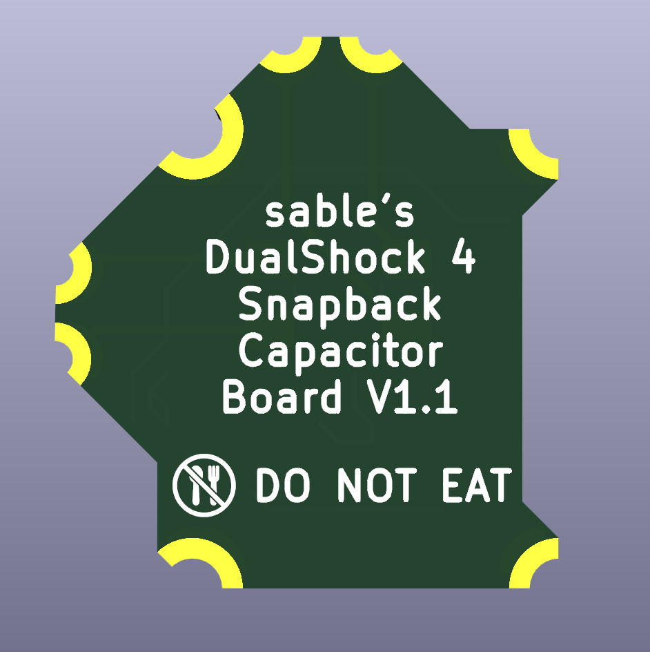

# DS4SnapbackBoard

This is a PCB that latches onto the bottom of your joysticks on a DualShock 4 intended to get rid of controller snapback.

# Why/About

Never heard of snapback? Here is a [video](https://www.youtube.com/watch?v=O4rigBTxgPM) describing it and why it is a problem.

I designed this because several of my DS4 controllers have had issues with snapback and the issues it entails, and because I prefered a cleaner result than through hole ceramic capacitors lying on the back of my controller's PCB.

This mod uses 0805 1uF ceramic SMD capacitors, since I wanted to make the capacitors somewhat easy to install and 1uF is a good catchall value to stop snapback. Different boards for different capacitor sizes can very easily be made, make an issue for a different size if you would like one.

This mod should not require much experience soldering, but if the capacitor size is too small, create an issue on this repo requesting a bigger size. Editing the PCB yourself to use bigger capacitors should be very easy as well.

# What you'll need

The PCB, of which gerbers are available for in the [releases](https://github.com/circuitsable/DS4SnapbackBoard/releases/tag/gerbers). The thinner you can make the PCB, the better, 0.8mm is a good thickness. The PCB can be ordered from any board house, but some may not like the castellated holes or charge extra for them. [Oshpark](https://oshpark.com/#services) will do castilated holes, has 0.8mm availability and is quite cheap, but the finished boards may require post processing with a small knife.

2 0805 1uF SMD Ceramic Capacitors. Their voltage rating does not matter. They can be sourced from anywhere, here are some examples: [Aliexpress](https://www.aliexpress.us/item/2251832778239041.html), [Ebay](https://www.ebay.com/itm/195680390537), [Mouser](https://www.mouser.com/ProductDetail/Samsung-Electro-Mechanics/CL21B105KPFNNNE?qs=349EhDEZ59rb3V94UrmRdQ%3D%3D)

Basic soldering equipment.

Hobby knife.

# Installation

Touch up the castilated holes of your PCB, as they will most certainly arrive with excess material from the pads being drilled. Solder the capacitors to their two available footprints on the PCB, align the PCB in the middle of the joystick footprint on the back of your DS4 board, solder the 4 big pads first to keep the board in alignment, then solder the pads to the actual potentiometer legs of the joysticks.

# PCB Images

